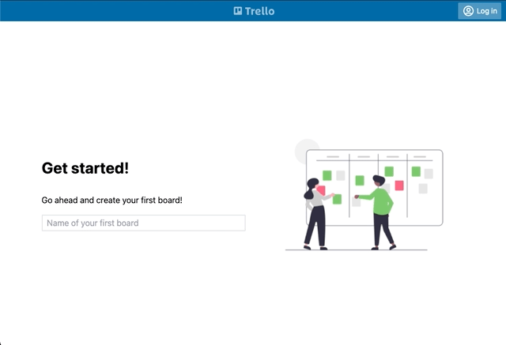

## Trello clone app written in Vue 3 + Typescript + Vite + TailwindCSS

 

    

This is a second version of [Trello clone](https://github.com/filiphric/trelloapp) app, which I use for my Cypress.io workshops. I create this to explain and showcase Cypress capabilities, much like [Real world application](https://github.com/cypress-io/cypress-realworld-app) by Cypress. 

To install, simply clone this project and

1. `npm install`
2. `npm start`

What you can see here is pretty much still work in progress and far from done. This is my Playground, don’t judge the code quality.
