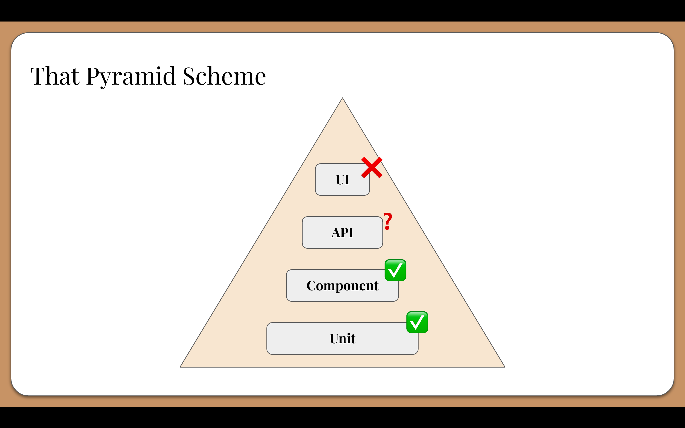
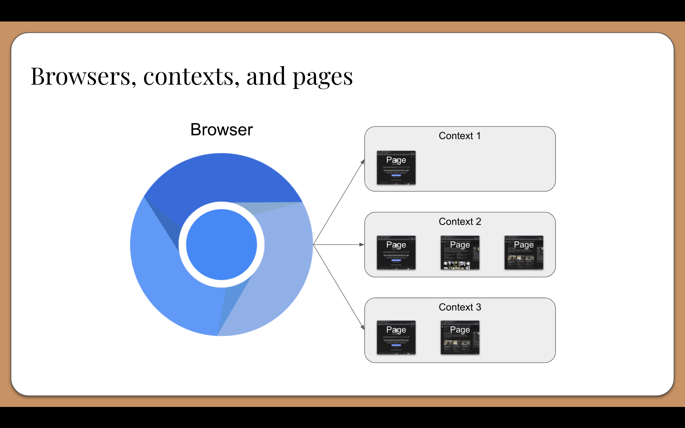
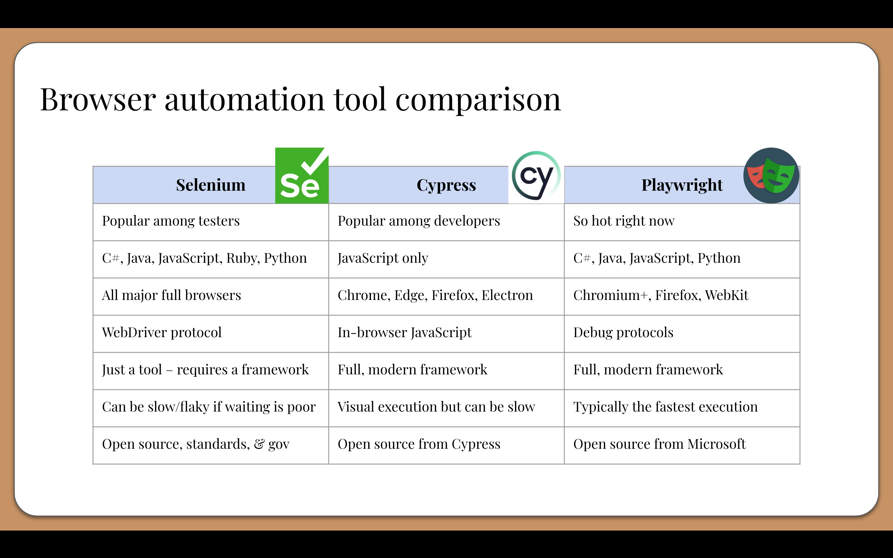

# Chapter 1: Setting modern web testing goals

In this chapter,
we will learn what it takes to be successful with modern web testing,
and we will learn how Playwright can help us reach our testing goals.

## A warning before starting

If you are taking this tutorial as part of a live session (like at a conference),
start the [tutorial setup steps in the README](../README.md#tutorial-setup) ***now***.
Project setup will download hundreds of MBs, which can stall your progress if the WiFi is slow.

## Web testing challenges

*Do you like it when bugs happen in your code?*
Most likely not.
Bugs are problems.
They shouldn't happen in the first place,
and they require effort to fix.
They're a big hassle.

*Would you rather let those bugs ship to production?*
Absolutely not!
We want to fix bugs before users ever see them.
Serious bugs could cause a lot of damage to system, businesses, and even reputation.
Whenever bugs do slip into production, we want to find them and fix them ASAP.

*Do you like to create tests to catch bugs before that happens?*
Hmmm... this question is tougher to answer.
Most folks understand that good tests can provide valuable feedback on software quality,
but not everyone *likes* to put in the work for testing.

Why doesn't everyone like to do testing?
**Testing is HARD!**
Here are common complaints I hear:

* Tests are *slow*
* Tests are *brittle*
* Tests are *flaky*
* Tests don't make *sense*
* Tests don't make *money*
* Tests require *changing context*

Historically, when teams created test automation strategies, they would follow the "Testing Pyramid",
which looked like this, from top to bottom:

Tests at the bottom were considered "better" because they were closer to the code, easier to automate, and faster to execute.
They were also considered to be less susceptible to flakiness and therefore easier to maintain.
Tests at the top were considered just the opposite: big, slow, and expensive.
The pyramid shape implied that teams should spent more time on tests at the base of the pyramid and less time on tests at the top.

End-to-end tests can be very valuable.
Unfortunately, the Testing Pyramid labeled them as "difficult" and "bad" primarily due to poor practices and tool shortcomings.
It also made testing strategy emphasize categories of tests over the feedback they delivered.

## Modern web testing goals

Testing doesn't need to be hard, and it doesn't need to suffer from the problems of the past.
We should take a fresh, new approach in testing modern web apps.

Here are three major goals for modern web testing:

1. Focus on building **fast feedback loops** rather than certain types of tests.
2. Make test development as **fast and painless** as possible.
3. Choose test tooling that naturally **complements dev workflows**.

These goals put emphasis on *results* and *efficiency*.

## Introducing Playwright

[Playwright](https://playwright.dev/) is a modern web testing framework that can help us meet these goals.

* It is an open source project from Microsoft.
* It manipulates the browser via (superfast) debug protocols
* It works with Chromium/Chrome/Edge, Firefox, and WebKit
* It provides automatic waiting, test generation, UI mode, and more
* It can test UIs and APIs together
* It provides bindings for JavaScript/TypeScript, Python, Java, and C#

In this tutorial, we will use Playwright with TypeScript.

Playwright takes a unique approach to browser automation.
First of all, it uses browser *projects* rather than full browser apps.
For example, this means you would test Chromium instead of Google Chrome.
Browser projects are smaller and don't use as many resources as full browsers.
Playwright also manages the browser projects for you, so you don't need to install extra stuff.

Second, it uses browsers very efficiently:

1. Instead of launching a full, new browser instance for each test,
   Playwright launches one browser instance for the entire suite of tests.
2. It then creates a unique *browser context* from that instance for each test.
   A browser context is essentially like an incognito session:
   it has its own session storage and tabs that are not shared with any other context.
   Browser contexts are very fast to create and destroy.
3. Then, each browser context can have one or more *pages*.
   All Playwright interactions happen through a page, like clicks and scrapes.
   Most tests only ever need one page.

Playwright handles all this setup automatically for you.

# Comparing Playwright to other tools

Below is a chart showing how Playwright compares to Selenium and Cypress,
two other popular browser automation tools:

Proceed to [Chapter 2](02-initial-exploration.md)