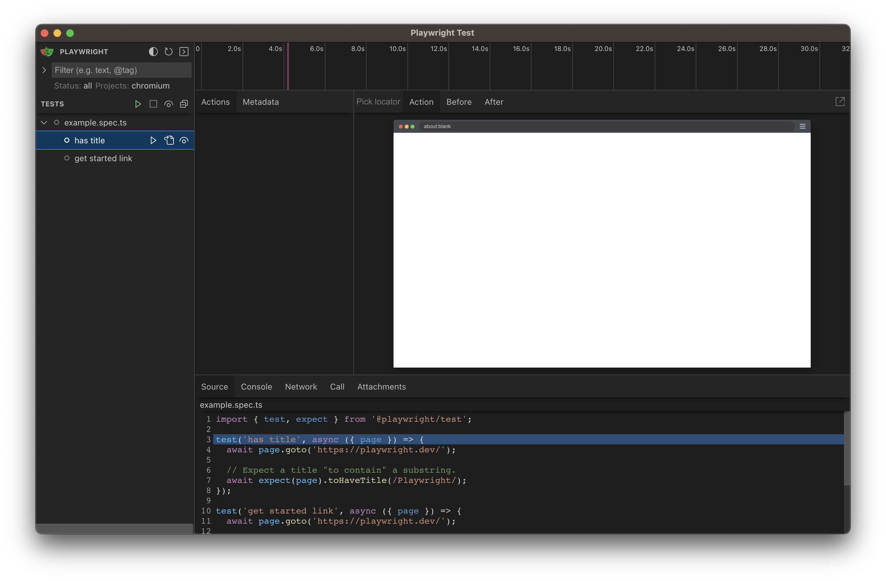
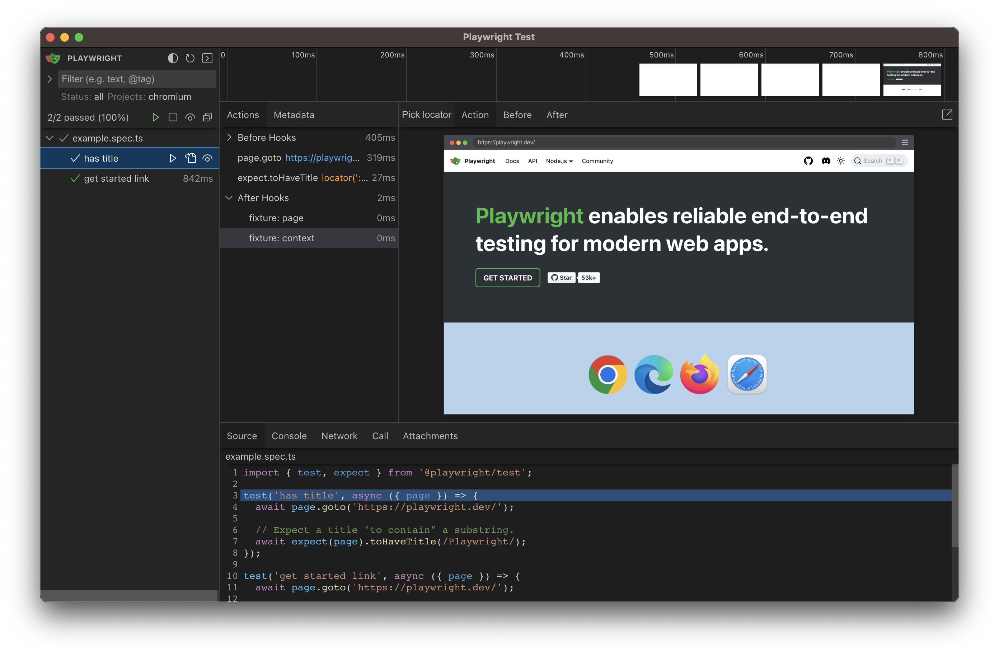
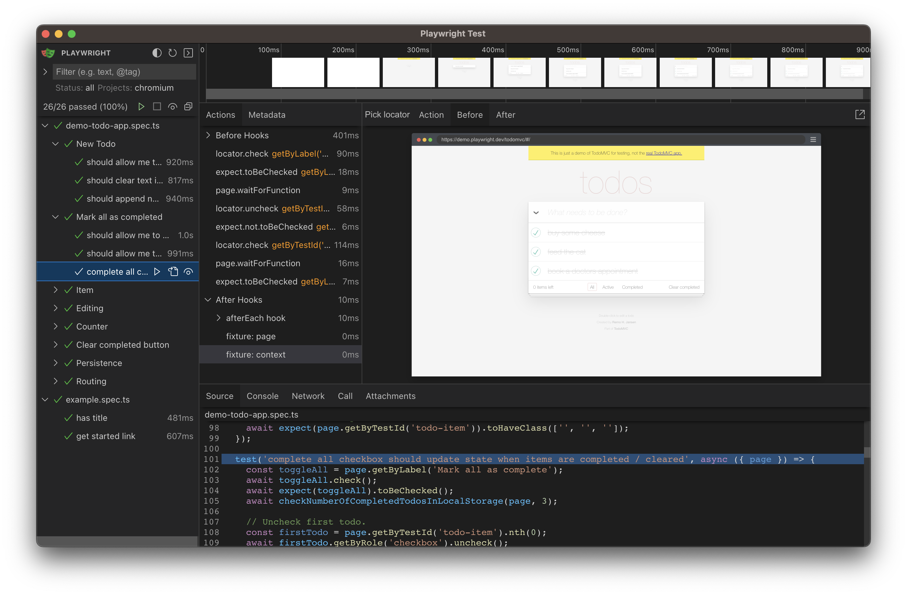
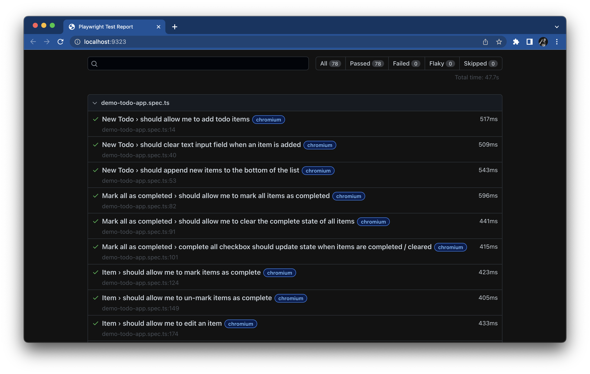
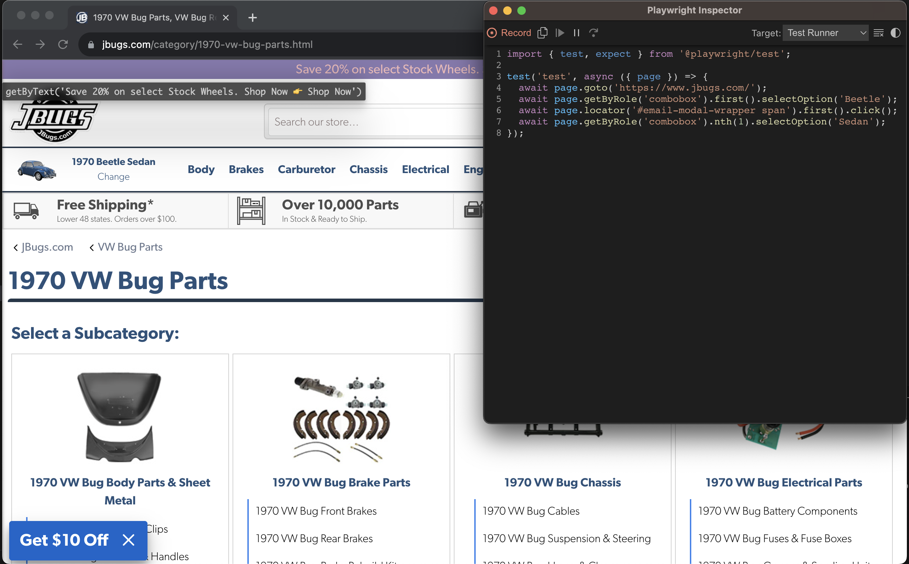

# Chapter 2: Exploring Playwright's features

In this chapter,
we will explore the many of Playwright's awesome testing features
by creating a new project and running the example tests.


## Creating a new Playwright project

If you haven't already done so as part of [tutorial preparations]((../README.md#tutorial-setup)),
let's create a new test project.
Create a new directory:

```
mkdir playwright-workshop
cd playwright-workshop
```

Then, initialize Playwright:

```
npm init playwright@latest
```

The `init` command will ask a series of prompts.
Accept the default answers for the questions:

1. Select `TypeScript` for the project language.
2. Select `tests` as the test directory.
3. Say `false` to adding a GitHub Actions workflow.
4. Say `true` to installing Playwright browsers.

This command will create a bunch of new project files, including:

* A `package.json` file with the Playwright package dependency
* A `playwright.config.ts` file with test configurations
* A `tests` directory with basic example tests
* A `tests-examples` directory with more extensive example tests

The command will also install the Playwright browser projects: Chromium, Firefox, and WebKit.
Beware that browser installation may take several minutes if your Internet connection is slow.

*Note:*
This tutorial was developed with Playwright 1.36.1.
Things might change in future versions.

*Note:*
If you are setting up an existing project that has Playwright as a dependency,
then you will need to run `npm install` and then `npx playwright install` to install Playwright properly.


## Running the tests visually

Playwright is a modern web testing framework with features that complement a front-end development workflow.
One of its most helpful features is [UI mode](https://playwright.dev/docs/test-ui-mode),
which visually shows and executes tests.
Let's use it to explore the automatically-generated example tests.

Run the following command to open UI mode:

```
npx playwright test --ui
```

A test execution window should open.
The left sidebar shows all the tests under the `tests` folder.
Click the tests to see their source code in the bottom Source pane.



The code from `example.spec.ts` should look like this:

```typescript
import { test, expect } from '@playwright/test';

test('has title', async ({ page }) => {
  await page.goto('https://playwright.dev/');

  // Expect a title "to contain" a substring.
  await expect(page).toHaveTitle(/Playwright/);
});

test('get started link', async ({ page }) => {
  await page.goto('https://playwright.dev/');

  // Click the get started link.
  await page.getByRole('link', { name: 'Get started' }).click();

  // Expects the URL to contain intro.
  await expect(page).toHaveURL(/.*intro/);
});
```

Click the triangle icon next to the test names to run the tests.
The tests should pass.
The center pane will then show a step-by-step trace of the test execution,
together with screenshots of each step.
You can also hover the mouse over the timeline trace at the top to see screenshots over time.



To see the more extensive examples,
move the `tests-examples/demo-todo-app.spec.ts` file to the `tests` directory,
and then explore those tests through UI mode.



UI mode is still manageable with larger test suites.
It even reloads automatically when code changes.


## Running the tests from the command line

Running tests from UI mode is helpful when developing the app and the tests,
but it's not ideal for running tests in a Continuous Integration (CI) system.
You can run tests directly from the command line like this:

```
npx playwright test
```

Tests will take a few seconds to run.
Results should look something like this:

```
Running 78 tests using 4 workers
  78 passed (15.0s)

To open last HTML report run:

  npx playwright show-report
```

Playwright will automatically run tests in parallel across multiple workers.
(You can explicitly set the number of workers it uses as well.)
If you look carefully at the console output while tests are running,
you will also see that Playwright will automatically run all tests across the three browser projects:
Chromium, Firefox, and WebKit.
(That's why the messages report 26 x 3 = 78 tests in total.)

You can view the full test report by running:

```
npx playwright show-report
```

This opens the report in a browser.
You can filter tests and click on results to view deeper trace.
Each results also bears a label for the browser it targeted.



If you want to run tests against only one browser instead of all browsers,
add the `--project` argument with the name of the browser.
For example, to run tests against Chromium only, run:

```
npx playwright test --project chromium
```

By default, Playwright runs tests *headlessly*,
meaning that it does not open a browser window to visually render the pages.
To see the pages rendered while tests are running, add the `--headed` option.
However, headed execution will slow down execution,
and should be reserved primarily for debugging tests one at a time.

For example:

```
npx playwright test tests/example.spec.ts --headed --workers 1 --project chromium
```

Usually, for debugging, it's better to use UI mode.


## Generating test code

Playwright also provides a test generator that enables you record interactions in a live browser.
While the test generator won't yield perfect test scripts,
it can help you find locators and interaction methods quickly.

To launch the test generator, run:

```
npx playwright codegen
```

Playwright will open two windows:
a browser window for capturing interactions,
and a window showing the recorded Playwright code for captured interactions.

Try loading a web page and making interactions with it.
You'll see Playwright code generated in real time.
Once recording is complete, you can copy the code and refine it into a test case.



Continue to [Chapter 3](03-first-test.md)