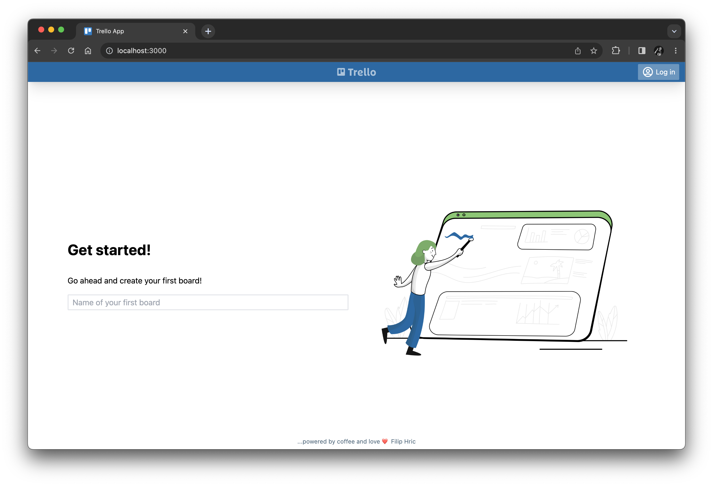
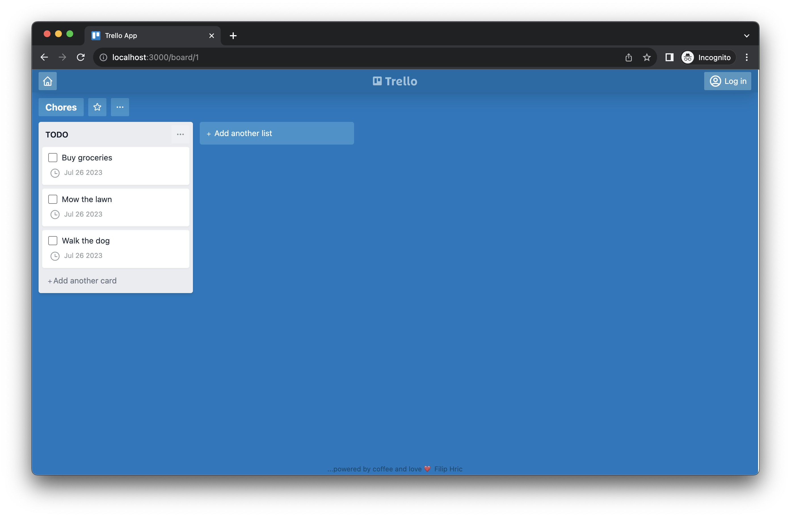
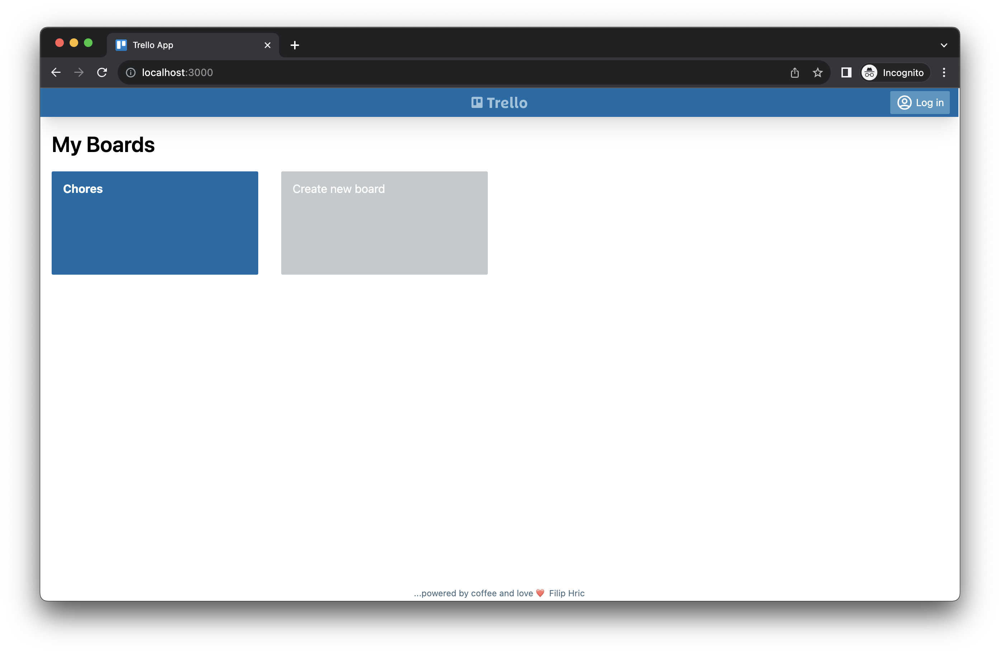
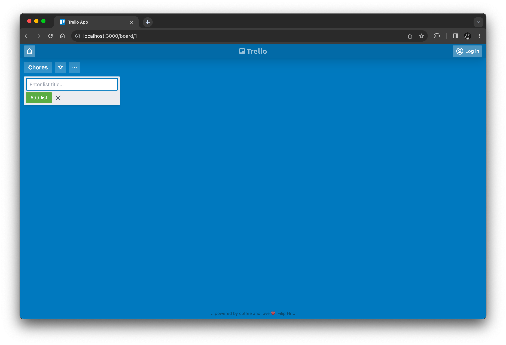
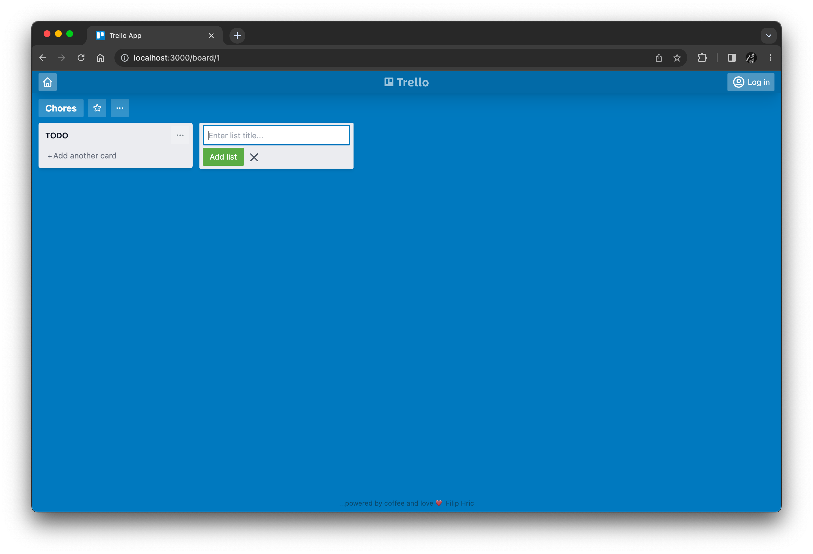
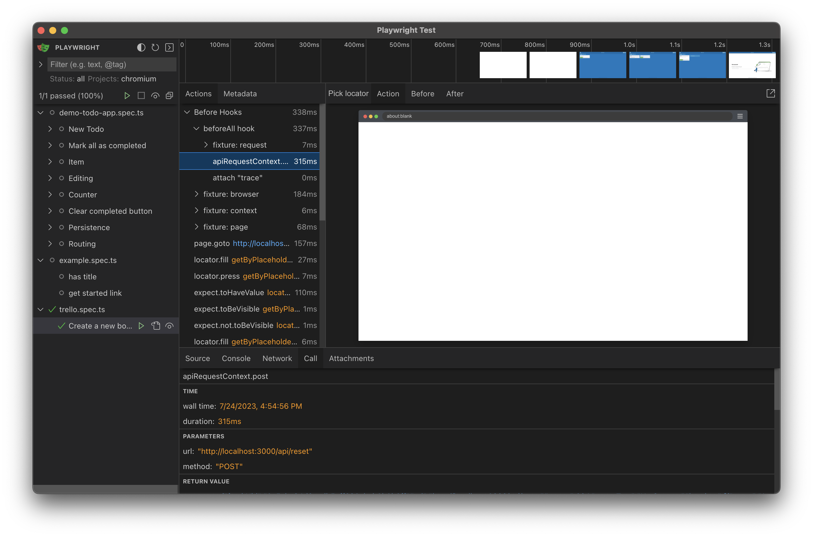

# Chapter 3: Writing our first test

In this chapter,
we will write our first Playwright test together
for a Trello-like web app that we will run locally.


## Setting up a local web app

Instead of testing some arbitrary public website,
let's test a web app that we can run and control locally
as if we were developing the app and its tests in tandem.
For this tutorial, we will use a Trello-like web app developed by [Filip Hric](https://github.com/filiphric).
The app is written in TypeScript using Vue 3, Vite, and Tailwind CSS.
Filip has granted his permission for us to use this project.

The GitHub repository for this app is:<br>
https://github.com/filiphric/trelloapp-vue-vite-ts

Clone the repository in a separate location from the `awesome-playwright-tests`:

```
cd </some/different/path>
git clone https://github.com/filiphric/trelloapp-vue-vite-ts.git
```

Then, install the project's dependencies:

```
cd trelloapp-vue-vite-ts
npm install
```

Make sure there are no errors.
Finally, run the app:

```
npm start
```

You should see output like this once the app is ready:

```
vite v2.9.12 dev server running at:

  > Local: http://localhost:3000/
  > Network: use `--host` to expose

  ready in 357ms.
```

Open a web browser to the local address provided (http://localhost:3000/),
and you should see the app's "Get Started!" page:




## Generating a script

Since Trello is essentially a Kanban board,
let's automate a test for creating a new board with a few cards.
Instead of writing everything from scratch,
we can use Playwright's test generator to record most of the interactions the test needs.

Launch the recorder:

```
npx playwright codegen
```

In the recording window, load the local app (http://localhost:3000/).
Enter a name for a new board, like "Chores".
Then, add a list with a few cards to the new board, like this:



Click the "home" button in the top-left corner,
and the app should display the "My Boards" page with the new board you just created:



That should be good for a first test.
Don't close the recording window yet, though!
Look at the code that Playwright generated while recording.
My code looked like this:

```typescript
import { test, expect } from '@playwright/test';

test('test', async ({ page }) => {
  await page.goto('http://localhost:3000/');
  await page.getByPlaceholder('Name of your first board').click();
  await page.getByPlaceholder('Name of your first board').fill('Chores');
  await page.getByPlaceholder('Name of your first board').press('Enter');
  await page.getByPlaceholder('Enter list title...').click();
  await page.getByPlaceholder('Enter list title...').fill('TODO');
  await page.getByPlaceholder('Enter list title...').press('Enter');
  await page.getByText('Add another card').click();
  await page.getByPlaceholder('Enter a title for this card...').fill('Buy groceries');
  await page.getByRole('button', { name: 'Add card' }).click();
  await page.getByPlaceholder('Enter a title for this card...').click();
  await page.getByPlaceholder('Enter a title for this card...').fill('Mow the lawn');
  await page.getByRole('button', { name: 'Add card' }).click();
  await page.getByPlaceholder('Enter a title for this card...').click();
  await page.getByPlaceholder('Enter a title for this card...').fill('Walk the dog');
  await page.getByRole('button', { name: 'Add card' }).click();
  await page.getByRole('navigation').getByRole('button').click();
});
```

The code you generated should look similar,
but it might not be identical - and that's okay.


## Converting it into a test case

The generated script is a good starting point,
but it is not yet a workable test case.
We must refine the interactions and add assertions.

Create a new file under the `tests` directory named `trello.spec.ts`.
Copy the code from the recording window,
and paste it into this new file.
The generated code is essentially one giant block,
so let's break it down into steps.


### Renaming the test

The entire test is part of a `test` function call:

```typescript
test('test', async ({ page }) => {
```

The name of the test is given as the first argument as a string: `'test'`.
Let's change that to something more meaningful:

```typescript
test('Create a new board with a list and cards', async ({ page }) => {
```

The second argument is an async function that contains the test case code.
Most Playwright calls are [asynchronous](https://developer.mozilla.org/en-US/docs/Learn/JavaScript/Asynchronous/Introducing).
Don't worry if you are not very familiar with asynchronous programming -
it just means that you'll need to add `await` when making Playwright calls.

The function declares a `page` argument.
This is a fixture that provides the Playwright `Page` object through which to make interactions.
Behind the scenes, Playwright creates the browser, context, and page objects for you.


### Step 1: Load the app

The first step loads the app:

```typescript
    // Load the app
    await page.goto('http://localhost:3000/');
```

This step calls `page.goto` to load the page given by the URL string.
Notice how it must be called with `await`.
We could make some assertions here to verify that the page is loaded correctly,
but for the sake of this test, we can consider that unnecessary.


### Step 2: Create a new board

The second step creates a new board:

```typescript
    // Create a new board
    await page.getByPlaceholder('Name of your first board').click();
    await page.getByPlaceholder('Name of your first board').fill('Chores');
    await page.getByPlaceholder('Name of your first board').press('Enter');
```

Each of these three lines use a [locator](https://playwright.dev/docs/locators)
to find and interact with the input element for the new board.
In this case, the code generator decided to use the `getByPlaceholder` locator,
which finds the input element based on its placeholder text: `'Name of your first board'`.

There are several different kinds of locators that automation can use.
For example, here's the HTML for that input element:

```html
<input
    type="text"
    data-cy="first-board"
    class="px-2 mt-4 w-full h-8 bg-white rounded-sm border-2"
    placeholder="Name of your first board"
    name="newBoard">
```

We could use the following CSS selectors instead of the placeholder text:

```typescript
page.locator('[name="newBoard"]')
page.locator('[data-cy="first-board"]')
```

Playwright supports every kind of locator imaginable:
IDs, CSS selectors, XPaths, built-in locators like the placeholder text, and more.
To learn more about writing good locators,
take the [Web Element Locator Strategies](https://testautomationu.applitools.com/web-element-locator-strategies/) course
on Test Automation University.

There are three interactions happening on the input element:

1. `click` to gain focus
2. `fill` to enter the textual name of the new board
3. `press` to type the ENTER key

With automation, we don't need to explicitly click the input before typing.
We can remove that line.
However, we do need to press enter once we finish typing. 
We can edit the code to be like this:

```typescript
    // Create a new board
    await page.getByPlaceholder('Name of your first board').fill('Chores');
    await page.getByPlaceholder('Name of your first board').press('Enter');
```

After creating the new board,
the app should display it on a new page with its name and an "Enter list title..." field:



The test should verify that this page appears as expected.
Add the following [assertions](https://playwright.dev/docs/test-assertions):

```typescript
    await expect(page.locator('[name="board-title"]')).toHaveValue('Chores');
    await expect(page.getByPlaceholder('Enter list title...')).toBeVisible();
    await expect(page.locator('[data-cy="list"]')).not.toBeVisible();
```

These assertions will make sure the new board page opens correctly.

* Since the board title element is an `input`,
  the first assertion must use `toHaveValue` instead of `toHaveText`.
* The second assertion verifies that the field for adding a new list is visible.
* The third assertion verifies that the board does not have any lists created.


### Step 3: Create a new list

The next step creates the first list on the board:

```typescript
    // Create a new list
    await page.getByPlaceholder('Enter list title...').click();
    await page.getByPlaceholder('Enter list title...').fill('TODO');
    await page.getByPlaceholder('Enter list title...').press('Enter');
```

The interactions are very similar to the previous step.
Again, the `click` interaction is unnecessary, so we can remove it.
We should also add assertions to make sure the list was actually created.
Try to inspect the page and come up with your own assertions:



The updated code should look something like this:

```typescript
    // Create a new list
    await page.getByPlaceholder('Enter list title...').fill('TODO');
    await page.getByPlaceholder('Enter list title...').press('Enter');
    await expect(page.locator('[data-cy="list-name"]')).toHaveValue('TODO');
```


### Step 4: Add cards to the list

The next step adds three cards to the list that was just created:

```typescript
    // Add cards to the list
    await page.getByText('Add another card').click();
    await page.getByPlaceholder('Enter a title for this card...').fill('Buy groceries');
    await page.getByRole('button', { name: 'Add card' }).click();
    await page.getByPlaceholder('Enter a title for this card...').click();
    await page.getByPlaceholder('Enter a title for this card...').fill('Mow the lawn');
    await page.getByRole('button', { name: 'Add card' }).click();
    await page.getByPlaceholder('Enter a title for this card...').click();
    await page.getByPlaceholder('Enter a title for this card...').fill('Walk the dog');
    await page.getByRole('button', { name: 'Add card' }).click();
```

In this step, the first click on "Add another card" is important
because the "Enter a title for this card..." input does not appear otherwise.
However, the subsequent clicks on "Enter a title for this card..." are not necessary.

Assertions should verify that the three cards appear.
Playwright makes it easy to verify the text not just for one element but for a list of elements:

```typescript
    await expect(page.locator('[data-cy="card-text"]')).toHaveText(
        ['Buy groceries', 'Mow the lawn', 'Walk the dog']);
```


### Step 5: Navigate to the home page

The final step to navigate back to the home page is a one-liner:

```typescript
    // Navigate to the home page
    await page.getByRole('navigation').getByRole('button').click();
```

What makes it unique, however, is that it uses a chain of locators find the home button:
`getByRole('navigation')` and then `getByRole('button')`.

Like preceeding steps, this step should also have assertions.
It should verify that the "My Boards" page is displayed and that it shows the new board:

```typescript
    await expect(page.getByText('My Boards')).toBeVisible();
    await expect(page.getByText('Chores')).toBeVisible();
```


### Adding database prep

There is one more thing to address: database preparation.
This test presumes that the app starts with an empty database.
If the app has any boards already created,
then the second step will fail because the app won't display the "Get Started!" page.

One simple solution is to clear the database before every test run.
That way, the test always starts "fresh" with an empty database.
This solution won't work when tests run in parallel,
but we will address that in a later chapter.
Let's keep things simple for now while we are learning the basics.

Thankfully, the Trello-like app has a secret API endpoint that essentially drops the whole database.
Calling `POST /api/reset` will delete everything in the database.
This endpoint should be used only for testing purposes.

[Playwright can call APIs](https://playwright.dev/docs/api-testing) using the `request` fixture.
Create a `test.beforeAll` hook,
and inside it, call `POST /api/reset` to the app:

```typescript
test.beforeAll(async ({ request }) => {
    // Clear the database
    await request.post('http://localhost:3000/api/reset');
});
```

*Note:*
The Trello clone app stores all its data in a local JSON file
located within the project at `backend/data/database.json`.
You may manually reset the data at any time by reverting this file to its original version.


### The completed test code

We have finished refining the script we generated into a test case!
Here's the full code:

```typescript
import { test, expect } from '@playwright/test';

test.beforeAll(async ({ request }) => {

    // Clear the database
    await request.post('http://localhost:3000/api/reset');
});

test('Create a new board with a list and cards', async ({ page }) => {

    // Load the app
    await page.goto('http://localhost:3000/');
    
    // Create a new board
    await page.getByPlaceholder('Name of your first board').fill('Chores');
    await page.getByPlaceholder('Name of your first board').press('Enter');
    await expect(page.locator('[name="board-title"]')).toHaveValue('Chores');
    await expect(page.getByPlaceholder('Enter list title...')).toBeVisible();
    await expect(page.locator('[data-cy="list"]')).not.toBeVisible();

    // Create a new list
    await page.getByPlaceholder('Enter list title...').fill('TODO');
    await page.getByPlaceholder('Enter list title...').press('Enter');
    await expect(page.locator('[data-cy="list-name"]')).toHaveValue('TODO');

    // Add cards to the list
    await page.getByText('Add another card').click();
    await page.getByPlaceholder('Enter a title for this card...').fill('Buy groceries');
    await page.getByRole('button', { name: 'Add card' }).click();
    await page.getByPlaceholder('Enter a title for this card...').fill('Mow the lawn');
    await page.getByRole('button', { name: 'Add card' }).click();
    await page.getByPlaceholder('Enter a title for this card...').fill('Walk the dog');
    await page.getByRole('button', { name: 'Add card' }).click();
    await expect(page.locator('[data-cy="card-text"]')).toHaveText(
        ['Buy groceries', 'Mow the lawn', 'Walk the dog']);
    
    // Navigate to the home page
    await page.getByRole('navigation').getByRole('button').click();
    await expect(page.getByText('My Boards')).toBeVisible();
    await expect(page.getByText('Chores')).toBeVisible();
});
```


## Running the test (carefully)

Let's run this test from UI mode:

```
npx playwright test --ui
```

Find the Trello test in the left sidebar, and click the play button.
The test should run and pass!
You can even inspect the Before Hooks to verify that the test reset the database beforehand:



UI mode provides a wealth of information such as trace and screenshots,
so it is very helpful to use while developing and debugging test code.
It also runs tests "safely" one at a time,
rather than running them in parallel across multiple workers.

If you want to run this test from the command line, be careful.
Our test data management strategy would not work if we run multiple tests in parallel.
For now, we need to limit our test execution to one worker:

```
npx playwright test tests/trello.spec.ts --workers 1
```

We will fix this later in the tutorial.

Continue to [Chapter 4](04-page-objects.md)